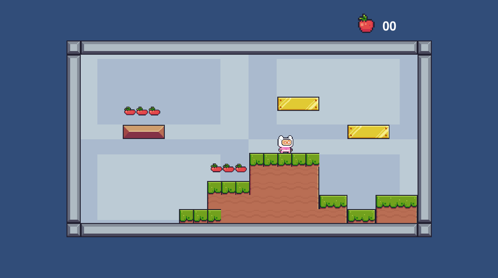

# Game 2D

Projeto da Disciplina de Extensão com objetivo de vivenciar a construção de um game 2D na plataforma Unity!

 

## Índice:

- [Requisitos](#requisitos)
- [Instalação](#instalação)
- [Equipe](#equipe)
- [Licença](#licença)

## Requisitos:

- [Unity Hub](https://unity.com/download) v3.6.1 (ou posterior)

## Instalação:

Siga as etapas abaixo para configurar e instalar o game em seu ambiente local:

1. Clone o repositório e acesse o diretório:

```bash
git clone git@github.com:brunohnsouza/game-2d-unity.git
cd game-2d-unity
```

Observe que uma pasta `GameAV2` foi criada dentro da pasta `game-2d-unity` 

2. Abra seu _**Unity Hub**_ e importe a pasta `GameAV2`  

3. Clique no projeto importado e, após carregar, clique no botão _**play**_

# Equipe:

- [Edvaldo Vitor](https://github.com/edvaldovitor250)
- [Arthur Morais](https://github.com/arthur-morais/)
- [Denis Gabriel](https://github.com/DenisGabriel017)
- [Walter Borges](https://github.com/wabpe)
- [Ednaldo Luiz](https://github.com/EdnaldoLuiz)
- [Bruno Henrique](https://github.com/brunohnsouza)
- [Caio Melo](https://github.com/CaioMelo10)
- [Matheus Sencades](https://github.com/SecondzzMSF)
  
## Licença:

[MIT](https://choosealicense.com/licenses/mit/)
